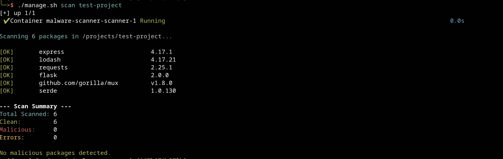
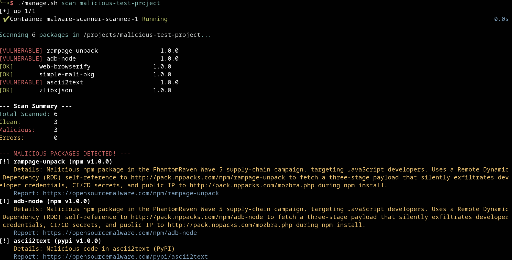

# OpenSourceMalware Scanner

A powerful supply chain attack scanner that identifies malicious dependencies and repositories using real-time data from [OpenSourceMalware.com](https://opensourcemalware.com/).

**No local Node.js or TypeScript installation required. Everything runs inside Docker.**

## 📌 Overview

This scanner is intended for source code repositories that use common package managers and dependency manifests. It currently scans:

- Node.js / npm projects from `package.json`
- Python / PyPI projects from `requirements.txt`
- Go projects from `go.mod`
- Rust projects from `Cargo.toml`

Use it when you want to check a local project folder or remote repository for known malicious dependencies reported by OpenSourceMalware.com.

## 🚀 Handoff Quick Start

This repository is intended to be handed off as a Git repo. A new user should be able to clone it, set one environment variable, build the Docker image, and start scanning.

### Prerequisites

- Git
- Docker Engine
- Docker Compose (`docker compose` or `docker-compose`)
- An OpenSourceMalware API key

### 1. Clone the Repository

```bash
git clone <your-repo-url> malware-scanner
cd malware-scanner
```

### 2. Configure the API Key

Copy `.env.example` to `.env`, then set your API key:

```bash
cp .env.example .env
```

```env
OSM_API_KEY=your_api_key_here
```

### 3. Build and Start the Scanner

```bash
./manage.py rebuild
```

### 4. Run a Scan

Clone or copy the project you want to scan into the local `projects/` directory first:

```bash
git clone https://github.com/user/repo.git projects/my-app
```

Scan everything under `projects/`:

```bash
./manage.py scan
```

Scan a single project folder such as `projects/my-app`:

```bash
./manage.py scan my-app
```

Scan a remote repository URL:

```bash
./manage.py repo "https://github.com/user/repo"
```

### Included Test Projects

This repository includes two local test projects under `projects/` for validating the scanner:

- `projects/test-project`
  A benign sample project for confirming clean detections across supported ecosystems.
- `projects/malicious-test-project`
  A sample project with known malicious dependencies for confirming positive detection behavior.

You can use them directly:

```bash
./manage.py scan test-project
./manage.py scan malicious-test-project
```

For real usage, clone your own repository into `projects/` and scan that folder with `./manage.py scan <project>`.

## 🖼 Screenshot Example	s

Clean scan example for `projects/test-project`:



Infected scan example for `projects/malicious-test-project`:



## 📦 Repository Setup

For handoff, keep the repository in this shape:

- `manage.py`
  Main operator entrypoint for build, container lifecycle, and scans.
- `docker-compose.yml`
  Defines the long-running scanner container and mounts `./projects` to `/projects`.
- `.env`
  Supplies `OSM_API_KEY` to the container.
- `.env.example`
  Template for creating `.env` during setup.
- `projects/`
  Drop local repositories or extracted source trees here before scanning. This folder also includes `test-project` and `malicious-test-project` as scanner test fixtures.
- `src/`
  TypeScript source for the scanner.
- `dist/`
  Compiled JavaScript executed inside the container.

If you are handing this repo to another engineer, include:

- A valid `README.md`
- `.env.example` or equivalent setup instructions for `OSM_API_KEY`
- Any sample projects in `projects/` only if they are safe to redistribute

## 🛠 Usage via Docker

### `manage.py` Command Reference

`manage.py` is the main entrypoint for running the scanner through Docker Compose.

```bash
./manage.py
```

Running it with no arguments opens an interactive menu with the same actions as the subcommands below.

Available commands:

```bash
./manage.py -h
./manage.py --help
./manage.py start
./manage.py build
./manage.py rebuild
./manage.py scan
./manage.py scan <project>
./manage.py repo <url>
./manage.py status
./manage.py shell
```

- `./manage.py -h` or `./manage.py --help`
  Shows built-in command help and examples.
- `./manage.py start`
  Starts the background `scanner` container with `docker compose up -d`.
- `./manage.py build`
  Builds the scanner image without recreating the running container.
- `./manage.py rebuild`
  Recreates the scanner container and rebuilds the image. Use this after changing Docker, Node.js, or TypeScript sources.
- `./manage.py scan`
  Scans everything mounted under `projects/`.
- `./manage.py scan <project>`
  Scans only `projects/<project>`.
- `./manage.py repo <url>`
  Scans a repository URL through the OpenSourceMalware API.
- `./manage.py status`
  Shows the current Docker Compose container status.
- `./manage.py shell`
  Opens a Bash shell inside the running scanner container.

### 1. Scan a Repository URL
Run the scanner inside the container:
```bash
./manage.py repo "https://github.com/user/repo"
```

### 2. Scan Local Code (Sandboxed)
Simply place your project folder inside the local `projects/` directory, then run:

```bash
./manage.py scan
```

To scan a specific subfolder such as `projects/my-app`:

```bash
./manage.py scan my-app
```

To test the scanner with the included fixtures:

```bash
./manage.py scan test-project
./manage.py scan malicious-test-project
```

The manager starts a background scanner container and mounts your local `projects/` folder into it at `/projects`. You can copy or clone projects into `projects/` on your host machine, and the running scanner container will see them immediately.

### Exit Codes

- Exit code `0`: scan completed and no malicious packages or repositories were detected.
- Exit code `1`: malicious content was detected, or the scanner hit an operational error such as a missing API key or invalid path.

For scan commands, a non-zero exit code is expected when malicious packages are found.

## 🔍 How It Works

1. **Self-Contained Build:** When you run `./manage.py rebuild`, Docker installs all dependencies and compiles the TypeScript code *inside* the container. Nothing is installed on your host machine.
2. **Isolation:** The scanner runs as a non-privileged user inside the sandbox.
3. **Detection:** The scanner identifies dependency files (`package.json`, `requirements.txt`, `go.mod`, `Cargo.toml`).
4. **API Query:** It queries `api.opensourcemalware.com` for real-time threat data.
5. **Reporting:** Results are color-coded and detailed.

---
Data provided by [OpenSourceMalware.com](https://opensourcemalware.com/)

## 🛡 Security Note
This tool is for **scanning and analysis only**. It does not download or execute any packages. For the best security, always run scans in a sandboxed environment when dealing with potentially malicious projects.

---
Data provided by [OpenSourceMalware.com](https://opensourcemalware.com/)
